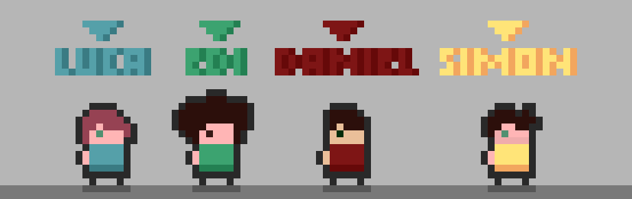

## Titel: PowerBomb

### 1.Spielbeschreibung 

Das Spiel "Power Bomb" ist ein Spiel des Genres "Battle Royale", in dem alle gegen alle spielen. Es können bis zu 4 Spieler im LAN oder 2 Spieler lokal gegeneinander antreten.  
Die Grundidee ist, dass Freunde oder Kontrahenten sich spontan ein spannendes, ergebnisoffenes Duell liefern können, dessen Ausgang sowohl durch das Können als auch durch das Glück der Spieler entschieden werden kann.  
Ziel des Spiels ist es, der letzte Überlebende zu sein. Um dieses Ziel zu erreichen, werfen die Spieler Bomben, die, gut platziert, die Gegner ins Jenseits befördern oder aber, ungeschickt geworfen, auch der eigene Untergang sein können – nicht nur, da sie auch dem Werfenden Schaden zufügen können, sondern auch, weil man nicht zu verschwenderisch mit den Bomben umgehen sollte: ist keine Munition mehr übrig, kann man sich nur noch im Nahkampf wehren! 

Im harten Kampf ums Überleben ist jeder Vorteil Gold wert. Die Spieler können, um Vorteile zu erringen, sich selbst oder ihre Bomben mit Power-ups verstärken. Also gilt es, schneller als die Gegner die besten Power-ups zu sammeln und sie nicht zuletzt auch bedacht und effektiv einzusetzen!  
Die begehrten Power-ups sind in zerstörbaren Blöcken versteckt, die sich im Umfeld der Spieler befinden. Sie können durch Bomben oder mit den bloßen Händen zerstört werden, was allerdings anstrengend ist und entsprechend länger dauert. Wird ein Block zerstört, werden mit einer gewissen Wahrscheinlichkeit Power-ups oder neue Bomben als Munition an dessen Stelle freigesetzt.
Des Weiteren gibt es unzerstörbare Blöcke, die für Spieler und Bomben Hindernisse darstellen.

Die Spieler starten entweder ohne Bombe oder mit einer geringen Anzahl an Bomben (diese Entscheidung wird während der Testphase getroffen). Die Spieler müssen daher zunächst die Blöcke manuell zerstören, um Bomben zu sammeln. 
Wirft man eine Bombe, so explodiert diese und fügt jedem Spieler innerhalb des Explosionsradius Schaden zu - er verliert Lebenspunkte.
Erhält ein Spieler so viel Schaden, dass seine Lebenspunkte auf null sinken, stirbt dieser Spieler.

Die Effekte aufgesammelter Power-ups addieren sich, sodass man mehrere Kombinationsmöglichkeiten hat.
**Die Power-ups repräsentieren jeweils ein Element oder eine Jahreszeit**, welches das Thema für das Modul ist: Die erfrischende, wohltuende Lebensblume repräsentiert den Frühling, die glühend heiße Feuerbombe den Sommer, der Speed-Blitz steht für ein Herbstgewitter und die klirrend kalte Eisbombe für den Winter. Weitere, viuselle oder Gameplay-Elemente in Bezug auf die Jahreszeiten können im Spielverlauf zu verschiedenen Zeitpunkten ins Spiel kommen.

Denn die Spieler werden von einem Timer begleitet, der wenn er abläuft, die Umgebung verkleinert – vom Spielfeldrand aus erscheinen Schritt für Schritt neue unzerstörbare Blöcke. So werden die Spieler, selbst wenn sie anfangs probieren, einander aus dem Weg zu gehen, weil sie hoffen, ihre Differenzen diplomatisch überwinden zu können, schließlich zum Konfrontationskurs gezwungen!

Die Storyline von "Power Bomb" ist nicht konkreter als das Szenario, in dem es gespielt werden soll: Zwei bis vier Charaktere sind gemeinsam in einem Duell gefangen und am Ende steht ein Sieger fest! Warum haben sie Bomben? Wieso sollen sie sich gegenseitig in die Luft jagen? Warum kann es gleichzeitig Frost und Feuer geben? Unwichtig, der Spielspaß kommt durch die Spontanität der Zusammenkunft, das gemeinsame Spielerlebnis und den Duellcharakter zustande!

---

### 2.Technische Elemente

**2D vs 3D**

Während die Umgebung, Licht und Partikeleffekte im dreidimensionalen Raum sind, sind unsere Charaktere und Power-ups zweidimensional. Diese Entscheidung nimmt uns einige Arbeit ab:
Dadurch, dass wir eine 3D-Umgebung haben, können wir Partikel Systeme mit ihr interagieren lassen. Das sieht nicht nur ansprechend aus, die Unity Engine hat es auch schon implementiert. 
Für die 2D-Sprites nutzen wir die Pixel Artstyle, auch diese Entscheidung spart uns Arbeit und durch den minimalistischen Kunststil sieht es ebenfalls cool aus. 

 

**Perspektive**

Wir nutzen eine Top-Down Ansicht, leicht angewinkelt, um die 3D-Elemente hervorzuheben.

   

**Steuerung**

Die Steuerung soll intuitiv sein und auch Spielern Spaß machen, die es nicht gewohnt sind, sich 20 verschiedene Steuerungselemente zu merken. Sie soll mit möglichst wenig Tasten auskommen.  
Im lokalen Multiplayermodus steuert man die Spieler komplett mit der Tastatur: klassisch vier Richtungstasten, es gibt acht Bewegungsrichtungen, wählbar durch das gleichzeitige Drücken zweier angrenzender Tasten: In der Ebene nördlich, östlich, südlich, westlich und die dazwischenliegenden Richtungen. Außerdem benötigt man jeweils eine weitere Taste für Nahkampf und das Werfen einer Bombe.  
Im LAN-Multiplayermodus steuert man die Spieler mit Maus und Tastatur.  
Controller sollen auch unterstützt werden.

---

### 3. "Big Idea"

"Power Bomb" ist unsere Version von Bomberman. Das Konzept des Spiels wurde beibehalten, aber es soll verrückter und "lebendiger" sein. Die 2D-Charackter im 3D-Raum lassen das alte "Retrogefühl" mit einem neuen, modernen Look verschmelzen.  
Das Spiel richtet sich an all Diejenigen, die diesen Klassiker lieben und ihn mit einem frischen Wind (egal zu welcher Jahreszeit) ins 21. Jahrhundert transferiert sehen wollen. Außerdem aber auch an alle, die das Spiel nicht kennen und das Gefühl vom schnellen, kurzweiligen Spiel mit Freunden neu erleben wollen.

Das Werfen der Bombe ist eine der Spezialitäten des Spiels und wichtigstes Abgrenzungskriterium zu seinem Vorbild, da im klassischen Bomberman die Bomben lediglich gelegt werden können. Jetzt muss der Spieler auch Zielen und auf seine Umgebung achten.

Ein weiteres wichtiges Feature sind die Power-ups. Es gibt Bomben- und Player-Power-ups. Die Bomben-Power-ups verändern die nächste Bombe, die man wirft: Es werden beim Explodieren je nach Power-up verschiedene Effekte ausgelöst.  
Diese Power-ups können sich auch wie in Bomberman addieren und verschmelzen. Ein denkbares Szenario wäre, dass man eine Feuer-Eis Bombe wirft und man anschließend einfriert und verbrennt.
Die Player-Power-ups haben einen positiven Effekt auf den Spieler, der sie einsammelt: zusätzliche Lebenspunkte oder eine höhere Bewegungsgeschwindigkeit.

---

### 4. Entwicklungszeitplan

**Funktionales Minimum**

**Minimales Ziel**

**Ziel**

**Wunschziel**

**Extras**

**Gantt-Chart als .xlsx**

[Siehe unter ./images/Enwicklungs_Layers/Spielentwicklung_Zeitplan.xlsx](./images/Entwicklungs_Layers/Spielentwicklung_Zeitplan.xlsx)

### 5. Teamaufteilung

**Alle** Game Designer und Developer

**Luca** VFX Artist

**Edi** Sound und 2D Artist

**Daniel** QA Engineer

**Simon** Producer
