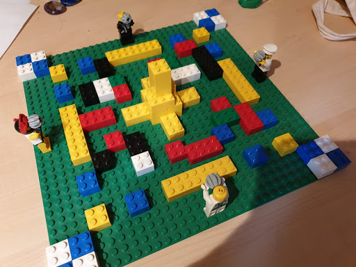
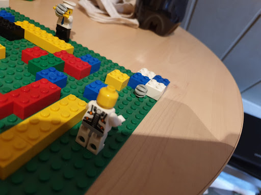
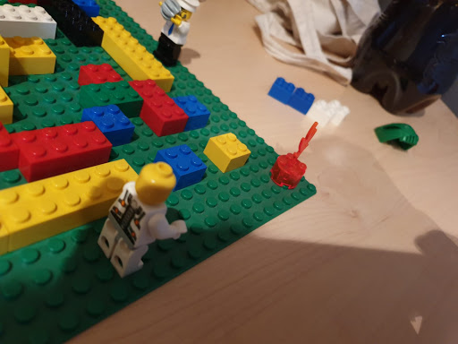
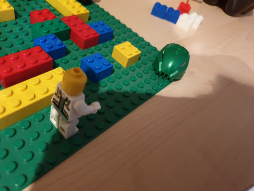
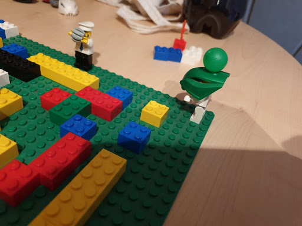
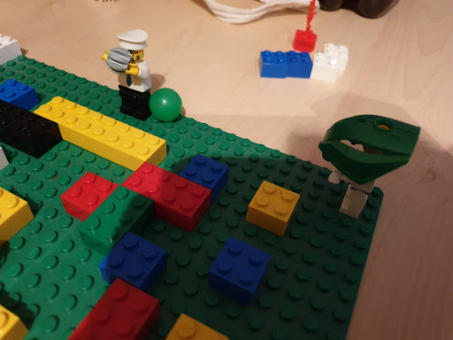
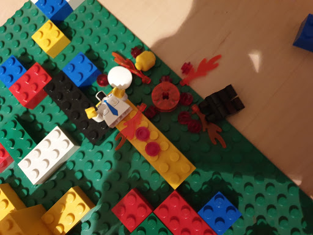

#### Der Prototyp

Hier sieht man den Startzustand des Spiels. Die Legoplatte ist der Grund, auf dem die Spieler sich bewegen. Die gelben Steine sind unzerstörbare Blöcke, alle anderen sind zerstörbar. Um die Warscheinlichkeit darzustellen, mit der man ein Power-up findet, haben wir blaue und weiße Blöcke als solche mit Power-up genommen. Im fertigen Spiel sehen sie allerdings alle gleich aus. In unserem Prototypen haben wir uns auf Power-ups beschränkt, die die Bomben verstärken sollen - ein verstärkendes Power-up enthält auch automatisch eine Bombe, damit es gleich einsetzbar ist.
Die vier Legofiguren repräsentieren die Spieler. Sie starten an den Rändern der Map damit sie sich nicht direkt töten können. Die Erhöhung in der Mitte der Karte hat nur ästhetische Gründe, sie ist gleichwertig mit den anderen gelben, unzerstörbaren Blöcken.

   

Hier ist zu sehen, wie ein Spieler eine Bombe auf blau-weiße Blöcke geworfen hat, um ein Power-up oder Bomben-Munition zu finden. Beim hier gezeigten Prototypen hatten die Spieler am Anfang eine Bombe. In einer anderen Version hatten die Spieler zu Beginn keine Bomben und mussten die Blöcke mit den Händen zerstören. In beiden Fällen war es so, dass das primäre Ziel zu Beginn die Kisten zu sind, da diese begrenzt sind und jeder so schnell wie möglich viel Munition und starke Bomben haben will. Mehr Spaß hat es mit einer Bombe am Anfang gemacht!

    

Die Bombe explodiert und die Blöcke sind zerstört.

   

Glück gehabt! Der Spieler findet ein Power-up. Jetzt muss er es nur noch schnell aufzusammeln - nicht, dass ihm jemand zuvor kommt!

   

Der Spieler hat das Power-up (grüner Hut) eingesammelt - seine nächste Bombe wird stärker sein!

   

 Der Spieler nutzt seine neue, bessere Bombe (mehr Schaden) und wird diese auf eienen anderen Spieler. 

Volltreffer! Die verstärkte Bombe hat den Gegner in Stücke gerissen. Dieser hat die Runde verloren.

Für die restlichen Spieler geht das Duell jetzt weiter, sie müssen Kisten sammeln und Bomben werfen, bis nur noch einer übrig bleibt: der Gewinner der Runde. 

**Der Prozess:**   
Als wir angefangen haben, den Prototypen zu bauen, hatten wir auch schon eine grobe Vorstellung wie er auzusehen hat.  
Da wir uns für ein blockartiges Map-Design entschieden haben, war ein Modell aus Lego unsere erste Idee. Die Karte zu bauen war relativ einfach - nach ein bis zwei Spielen / Iterationen hatten wir sie wie im oben gezeigten Bild aufgebaut. 
Die Power-ups darzustellen, hat uns mehr Überlegung gekostet. Wir mussten uns überlegen, wie ein Spieler, der eine verstärkende Bombe einsammelt diese Verstärkung auch behält, bis er die Bombe wirft.
Die Entscheidung fiel zugunsten von Masken und einer Murmel in passender Farbe. Das Auf- und Absetzen der Masken hat den Spielfluss allerdings etwas gestört. 
Ein weiterer Nachteil an den Masken ist auch, dass alle sehen, wer als nächstes was für eine Bombe werfen wird, was in dem fertigen Spiel nur jeder Spieler für sich sehen soll. Jedoch konnten wir in unserem Prototypen auf das für unser Spiel so wichtige Element - die Verstärkung der Bomben - nicht verzichten.   
Die Weiteren, folgenden Iterationen haben nicht mehr das Aussehen des Prototypen sondern lediglich die Spielregeln verändert - die wichtigste: Verringerung der Wurf-Reichweite auf 1/4 Kartengröße.

**Was hat uns die Entwicklung gebracht?**   
Wir konnten bestätigen, dass das Spiel Spaß macht. Allein als Figur auf einer Legplatte rumzurennen, Blöcke herunterzureißen und Murmeln zu werfen fanden wir schon amüsant.
Aufgefallen ist uns, dass die Reichweite der Bomben große Auswirkung auf das Spiel hat. Wenn ein Spieler eine Bombe von einer Seite der Karte zur anderen werfen kann, macht das direkt weniger Spaß, da man sich nicht wirklich bewegen muss. Verringert man die Reichweite, muss man sich erst zu den Gegnern durchschlagen. (Vorausgesetzt, man schummelt nicht...!).
Ergänzend zur Reichweitenverringerung wollen wir im fertigen Spiel auch die Karte größer machen.

