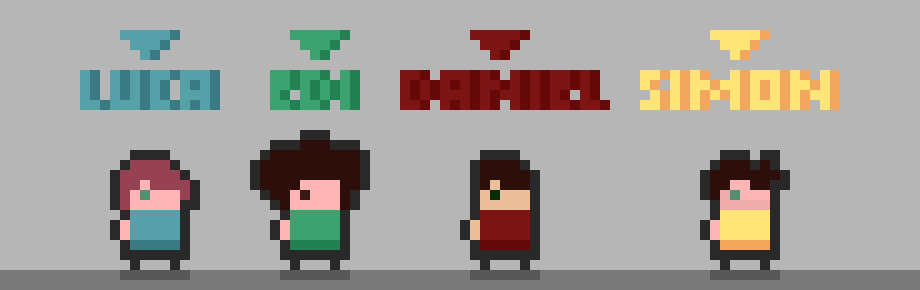
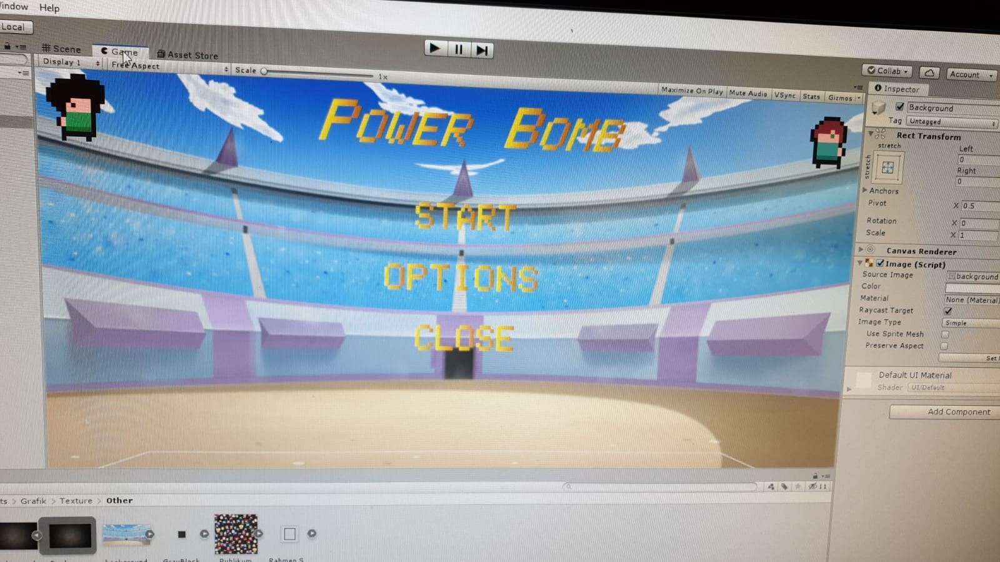
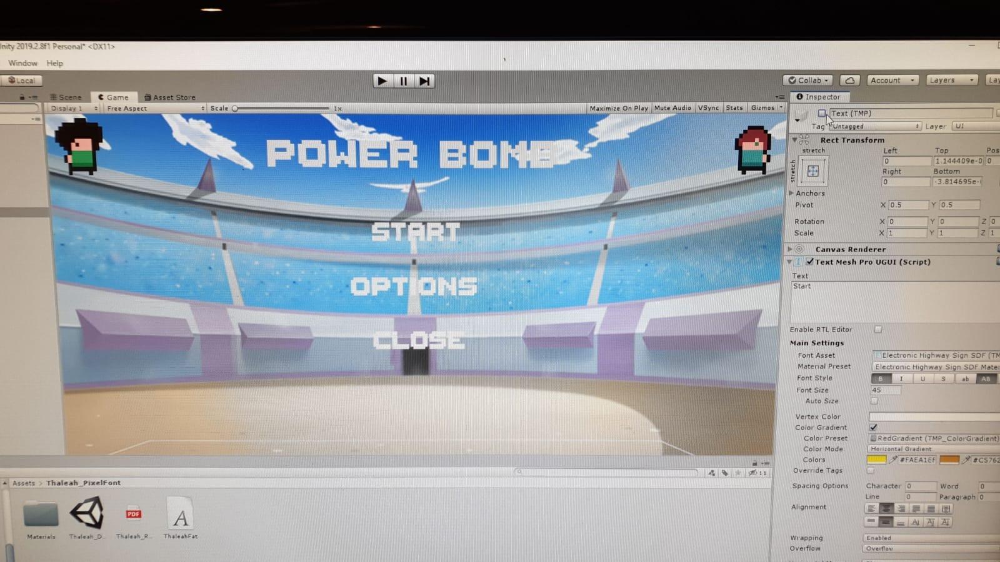
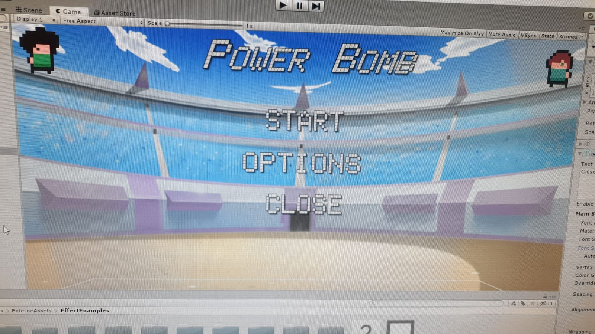

# Zwischenbericht PowerBomb

1. [Player](##Player)
2. [Bomben](##Bomben)
3. [Power-ups](##Power-ups)
4. [Map](##Map)
5. [Menü](##Menü)

## Player
* Layer 1:  
Der Spieler kann sich bewegen  
Der Spieler kann sterben  
Der Spieler kann Blöcke mit der Hand zerstören  
Der Spieler hat Animationen

* Layer 2:  
Der Spieler besitzt Sound Effekte  
Jeder Spieler hat ein GUI-Element (Lebensbalken, Anzahl der Bomben, Portrait etc.)

* Layer 3:  
Der Spieler kann Bomben zurück werfen  
Der Spieler erhält visuelle Effekte

* Layer 4:  
Der Spieler kann über Maus und Tastatur gesteuert werden  
Der Spieler kann über LAN-Networking mit anderen Spielern spielen

* Layer 5:  
Mehr Skins

### **Aktueller Arbeitsstand**
Wir haben Layer 2 komplett abgeschlossen.  
Wir haben für den Spieler vier verschiedene Skins bzw. Sprites im Pixel Art Style erstellt.

Diese Skins repräsentieren jeweils eine Person aus dem Team und haben für das Spiel inhaltlich keine Bedeutung.   
Pro Skin gibt es eine Idle-Animation, Walk-Animation und eine Death-Animation.

Der Spieler besitzt folgende 6 Skripte:

* Player Controller  
ist für die Bewegung des Spielers zuständig und gibt an welcher Input der Spieler momentan erhält, welche Richtung er schaut und ob er sich bewegt
* Player Animator  
enthält alle Methoden die eine Animation vom Animation Controller triggern
* Player Data  
enthält Meta-Informationen vom Spieler für den Game Manager
* Bomb Manager  
kümmert sich um die Bomben Logik
* Player Audio  
spielt bei Bedarf einen gewünschten Sound ab
* Player Manager  
die Schnittstelle aller Skripte des Spielers.
Sie enthält alle Parameter für die anderen Skripte und kümmert sich zusätzlich um weitere Funktionen wie das Verändern der Lebenspunkten des Spielers. 

Der Spieler hat zudem auch noch zwei GameObject Children:

* **Arrows** hilft den Spieler bei der Navigation  

* **AttackBox**, eine TriggerBox die Schaden triggert sobald ein Objekt im Bereich ist und der entsprechende Key gedrückt wurde.

Beide Spieler haben jeweils eine GUI Anzeige.

  
 

**Die Lebensanzeige**, der grüne Balken repräsentiert das Leben  

  

**Die Bombenanzeige**, sie repräsentiert die Anzahl der Bomben die der Spieler zur Verfügung hat

 

**Die Vorschauanzeige**, sie zeigt für welchen Spieler dieses GUI-Element gehört, als Extra haben wir die rechte Grafik sobald der Spieler gestorben ist.

### **Was hat reibungslos geklappt?**

Die einzelnen Skripte waren **schnell implementiert** und auch das Skript Player Manager als Schnittstelle für alle Gruppenmitglieder hat sehr gut funktioniert. Die Sprites waren schnell entwickelt und bei der Animation gab es **keine Komplikationen**.

 ### **Was hat etwas mehr Mühe gekostet?**
Da der Spieler viele verschiedene Funktionen hat, mussten wir uns überlegen wie wir diese Funktionen aufteilen. Wir haben uns dafür entschieden, dass der Player-Manager die Anlaufstelle für andere Skripte ist und gleichzeitig die internen Player Skripte dirigiert.

## Bomben 

Jeder Spieler hat am Anfang die Standardbombe. Wenn er Power-ups sammelt ändert sich die nächste Bombe, die er wirft. 
Eine Bombe hat einen Explosionsradius und je nach Power-up einen visuellen Effekt und einen Effekt auf dem getroffenen Spieler. 
Sammelt der Spieler zum Beispiel ein Winter-Power up, wird die Bombe blau, der Radius ist größer und wenn ein spieler getroffen wird, wird er zusäzlich zum Schaden ein paar Sekunden langsamer ([siehe Power-ups](##Power-ups)).

### **Aktueller Arbeitsstand**

Layer 1-2 sind abgeschlossen:  
Die Spieler können Bomben werfen. Bei jedem Wurf wird eine neue Instanz einer Bombe erstellt mit den Attributen, die die Power-ups übergeben haben.  
Die Bomben haben einen sichtbaren Radius, der sich dynamisch an den Explosionsradius anpasst und anzeigt, wo die "Gefahrenzone" ist.

explodiert eine Bombe, kriegen alle Elemente (zerstörbare Blöcke und Spieler) im visualisierten Radius Schaden. 

### **Was hat reibungslos geklappt?**
Das Implementieren des Werfens einer Bombe hat gut geklappt. Dadurch, dass wir schon Bewegungspfeile erstellt hatten, die die Bewegungsrichtung des Spielers speichern, konnten die Bomben diese Richtungen übernehmen. Diese können dann in die passenden Vektoren für den Flug umgerechnet werden. 

### **Was hat etwas mehr Mühe gekostet?**
Eine Herausforderung war der visuelle Radius der Bombe. Das erste Problem war, dass der Radius immer mit der Bombe rotiert hat.  
Nach längerer Recherche haben wir dann rausgefunden, dass es sehr schwer ist, ein Kindobjekt (den Radius) von seinem Parent (der Bombe) in der Rotation zu trennen. Als Lösung haben wir ein neues Parent-Objekt erstellt, das eine  Kugel (die Bombe) und eine Scheibe (den Radius) als Kinder hat.  
Die Größe des visuellen Bombenradius auf den Explosionsradius hat auch Probleme bereitet. Die Rechnungen zur Änderung des Radius haben sich auf Radiuswerte konzentriert. Beim Testen ist uns aufgefallen das der angezeigte Radius nicht zum Explosionsradius passt. Schließlich hat sich herausgestellt, dass in Unity eine Längeneinheit bei Kugeln dem Durchmesser und nicht dem Radius entspricht. Wir mussten also unsere Rechnung dementsprechend anpassen.

## Power-ups
Es gibt Bomben- und Player-Power-ups. Die Bomben-Power-ups verändern die nächste Bombe, die man wirft: sie haben eine andere Farbe und es werden beim Explodieren je nach Power-up verschiedene Effekte ausgelöst.
Diese Power-ups können sich auch wie in Bomberman addieren und verschmelzen. Es ist also möglich, dass man eine Feuer-Eis Bombe wirft und der getroffene Spieler gleichzeitig einfriert und verbrennt. Die Player-Power-ups haben einen positiven Effekt auf den Spieler, der sie einsammelt: zusätzliche Lebenspunkte oder eine höhere Bewegungsgeschwindigkeit.

* Layer 1:  
Power-ups spawnen  
Power-ups können von Spielern eingesammelt werden 

* Layer 2:
Die Bomben-Power-ups verändern Attribute der Bombe  
Die Bombe setzt, je nach Power-up, einen Effektbereich frei, in dem die Spieler manipuliert werden (Schaden über Zeit bei Feuerbombe, langsamere Bewegung bei Eisbombe)  
Player-Power-Ups manipulieren die Spieler (Lebensblume gibt Lebenspunkte, Speed-Blitz erhöht die Bewegungsgeschwindigkeit)

* Layer 3:
Bessere Visualisierung der Power-up-Status-Effekte (wenn der Spieler "brennt" oder "eingefroren" ist, sollte dies sichtbar sein)

* Layer 4:  
--   

* Layer 5:  
Weitere Power-ups 

### **Aktueller Arbeitsstand**
Layer 1 und 2 sind komplett abgeschlossen. Es gibt je zwei Bomben- und Player-Power-ups: 

Die Feuer- und Eisbombe mit Area of Effect nach der Bombenexplosion (Im Beispiel zunächst normale Bombe, nach Einsammeln des Power-Ups verändert sich das Aussehen der Bombe und ihrer Explosion entsprechend dem Eis-Effekt, ihr Flächeneffekt, gleicht z. Zt. visuell jedoch noch dem Feuer-Flächeneffekt.)

 

(Oberes Bild) Der Spieler, der sich nach der Explosion in den Effektbereich der Eisbombe (AoE) begibt, wird verlangsamt, die Verlangsamung bleibt ab dem Verlassen des Bereiches für 5 Sekunden bestehen  

Hier sieht man, dass das Kombinieren der Effekte bereits funktioniert. Zuerst wird nur die Feuerbombe geworfen, dann eine Kombination aus Eis- und Feuerbombe. Sowohl die Farbe der Bombe, als auch die Explosion und die Effektbereiche werden kombiniert (Letzteres ist aufgrund der fehlenden Eis-Antimation noch nicht gut sichtbar).

Im AoE der Feuerbombe bekommt der Spieler pro Sekunde einen kleinen Bruchteil seiner Lebenspunkte abgezogen, nach dem Verlassen des Bereiches ebenfalls für 5 weitere Sekunden.

Als Player-Power-Up die Lebensblume und den Speed-Blitz:

Beim Einsammeln der Lebensblume bekommt der Spieler Lebenspunkte.  
Beim Einsammeln des Speedblitzes wird die Bewegungsgeschwindigkeit des Spielers für 5 Sekunden erhöht.

 ### **Was hat reibungslos geklappt?**
Vergleichsweise problemlos war das Implementieren des Player-Power-Ups "Lebensblume" da lediglich ein Methode im Player Manager-Skript [(s. Player)](##Player) aufgerufen werden muss, die die Lebenspunkt-Werte hoch setzt.

 ### **Was hat etwas mehr Mühe gekostet?**
Etwas aufwändiger waren die Bomben-Power-Ups, da sie Effektbereiche (AoE) haben, die für eine bestimmte Zeit andauern. Die Spieler sollen nach dem Verlassen der Bereiche noch für eine Zeitspanne weiter unter Einfluss der Effekte stehen. Zuerst war der Gedanke, für den Bereich der Bomben im OnTriggerExit()-Event die Effekte für eine bestimmte Zeit andauern zu lassen. 
Doch das Problem: Wenn der AoE verschwindet, während ein Spieler noch drin ist, wird kein OnTriggerExit()-Event ausgelöst. In diesem Fall würde der Effekt also direkt aufhören, was aber nicht erwünscht ist.  
Die Lösung: Speichern der Spieler, die sich im AoE befinden in einer Liste, (löschen beim Verlassen), sobald der AoE verschwindet, wird bei allen Spielern, die sich in der Liste befinden, der Effekt für die festgelegte Zeit ausgeführt.

## Map

* Layer 1:  
Map Prototype  
Map Timer  
Zerstörbare Blöcke

* Layer 2:  
Map Sound Effekte

* Layer 3:  
Sudden Death  
Camera Shake

* Layer 4:  
--   

* Layer 5:  
Mehr Maps

### **Aktueller Arbeitsstand**

Die Spielfläche der Map beträgt 10x10 Blöcke ( 1 Block so groß wie 1 Spieler )  und besteht aus jeweils zerstörbaren und unzerstörbaren Blöcken.

        Zerstörbar        Unzerstörbar

Die Blöcke kann man entweder durch eine Bombe zerstören oder durch den Nahkampf Angriff des Spielers. Um dem Spieler den Lebensstatus des Blocks zu visualisieren haben wir eine Animation für den Block entwickelt.

(**Links**) Ist der normale zerstörbare Block, wird dieser zerstört, wird er mit dem Block (**rechts**) ausgetauscht. Dieser wurde mithilfe von Blender manipuliert sodass dieser Block aus Fragmente besteht. Diese einzelnen Fragmente haben eine RigidBody-Komponente und können unabhängig mit der Umgebung interagieren.  

Die Map hat einen Timer, den man beliebig einstellen kann. Je nach Zeit verändert sich die Lichtstimmung, sobald 50% der Zeit abgelaufen ist, wird das Licht gelb, sobald 75% abgelaufen sind wird es rot.  

 

Die Map soll wie ein Stadion wirken, ein Schlachtfeld bejubelt vom Publikum.
So ist der Hintergrund der Map gefüllt mit Zuschauern.

Nach dem Ablauf des Map-Timers kommt es zum Sudden-Death: Ein tödlicher Bombenregen bricht über die Spieler herein! Zufällig über die Map verteilt, Ausweichen ist möglich, aber nicht auf Dauer!

 ### **Was hat reibungslos geklappt?**

Die Sprites passen gut zusammen, das Licht und der Hintergrund geben das Gefühl eines Stadions und die Audio unterstützt diesen Eindruck. Die Implementation des Timers war schnell erledigt.

 Was hat etwas mehr Mühe gekostet?
Viele Blöcke mussten wir per Hand nach korrigieren, da wir die Map nicht programmiert sondern per Drag n Drop gebaut haben.

## Menü

### Aktueller Arbeitsstand
Funktionierendes Hauptmenü (erstes Bild) von dem man in die nächste Szene (Spiel) gelangt oder in das Optionsmenü (zweites Bild) dessen Schieberegler zum aktuellen zum aktuellen Zeitpunkt noch keine Auswirkungen auf das Spiel haben. Der Close-Button beendet das Spiel wenn es nicht im Unity-Editor aufgerufen wurde.

 
  

 ### **Was hat reibungslos geklappt?**
Konstruktion der einzelnen Elemente und Verlinkungen bisher.

### **Was hat etwas mehr Mühe gekostet?**
Einigung auf einen Stil für das Menü.  
Versionsverlauf:

Zu gruselig:  

Schrift zu gelb:  

Schrift zu unlesbar:  

Titel-Schrift zu kursiv:  
