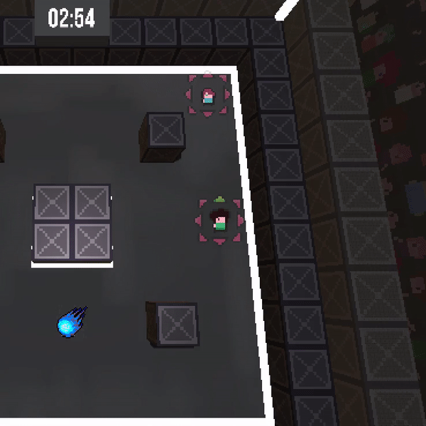
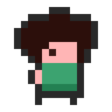
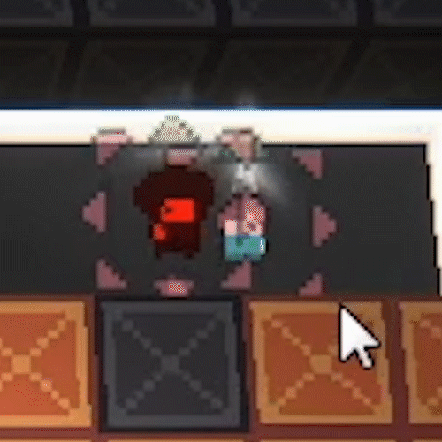

#### Alpha-Release

1. [Player](##Player)
2. [Map](##Map)
3. [Extra](##Extra)

## Player
* Layer 1:  
Der Spieler kann sich bewegen  
Der Spieler kann sterben  
Der Spieler kann Blöcke mit der Hand zerstören  
Der Spieler hat Animationen

* Layer 2:  
Der Spieler besitzt Sound Effekte  
Jeder Spieler hat ein GUI-Element (Lebensbalken, Anzahl der Bomben, Portrait etc.)

* Layer 3:  
Der Spieler kann Bomben zurück werfen  
Der Spieler erhält visuelle Effekte

* Layer 4:  
Der Spieler kann über Maus und Tastatur gesteuert werden  
Der Spieler kann über LAN-Networking mit anderen Spielern spielen

* Layer 5:  
Mehr Skins

### **Aktueller Arbeitsstand**
Der Layer 3 ist fast abgeschlossen.

**Der Spieler hat jetzt die Möglichkeit, Bomben aufzunehmen und erneut zu werfen.**

Es gab Probleme mit dem Collider der Bombe, sodass man die Bombe als GameObject nicht einfach über dem Spieler platzieren konnte.
Daher haben wir dem Spieler ein neues GameObject hinzugefügt, das als Stellvertreter für die Bombe fungiert, wenn sie aufgehoben wird.

**Dadurch kam aber die Herausforderung das die Bombe trotz dem Aufnehmen noch explodieren muss.**

Also muss das stellvertretende GameObject wissen, wie viel Zeit der Bombe bis zur Explosion noch blieb, als der Spieler sie aufgenommen hat, außerdem muss diese Information wieder zur richtigen Bombe weitergereicht werden, wenn diese dann wieder geworfen wird.

Die Charaktere haben **3 neue Animationen** erhalten, die zum Spielerlebnis beitragen.
Eine neue Idle Animation, um den Charakter lebendiger zu machen.
Zwei Attack-Animationen die abwechselnd spielen, um den Nahkampf **noch spaßiger** zu gestalten.

Außerdem gibt es einen neuen **Schaden Effekt** der dem Spieler signalisiert, dass dieser Schaden erhalten hat.

 

Allerdings fehlen noch einige Effekte für den Charakter, beispielsweise wenn der Spieler brennt oder verlangsamt ist.

## Map

* Layer 1:  
Map Prototype  
Map Timer  
Zerstörbare Blöcke

* Layer 2:  
Map Sound Effekte

* Layer 3:  
Sudden Death  
Camera Shake

* Layer 4:  
--   

* Layer 5:  
Mehr Maps

### **Aktueller Arbeitsstand**

Alle Layer bis Layer 4 sind komplett. 
Wir haben **alle 24 Sounds** implementiert.

[Externes Video mit Sounds auf YouTube](https://youtu.be/vPb-CWYQquY)

- **1 Sound für das Bewegen der Spieler**
- **1 Sound für den Nahkampf Schlag**
- **1 Sound für das Erhalten von Schaden**
- **1 Sound für das Sterben eines Spielers**
- **1 Sound für das Werfen der Bombe**
- **1 Sound für den Aufprall der Bombe auf dem Boden**
- **1 Sound für die Explosion der Bombe**
- **6 Sounds für das Treffen und Zerstören der Kisten**
- **9 Sounds für die Power Ups**

## Extra

Wir haben einige kleine Veränderungen vorgenommen, um das Spielerlebnis zu verbessern.
Beispielsweise, dass die zerstörbaren Blöcke nicht immer im gleichen Muster zerbrechen und ein Camera Shake zu bestimmten Events.

**Zusätzlich haben wir auch leichtes Balancing begonnen.**

**Eines der größeren Extras ist das Post Processing.**

 

links: ohne Post Processing, rechts: mit Post Processing

