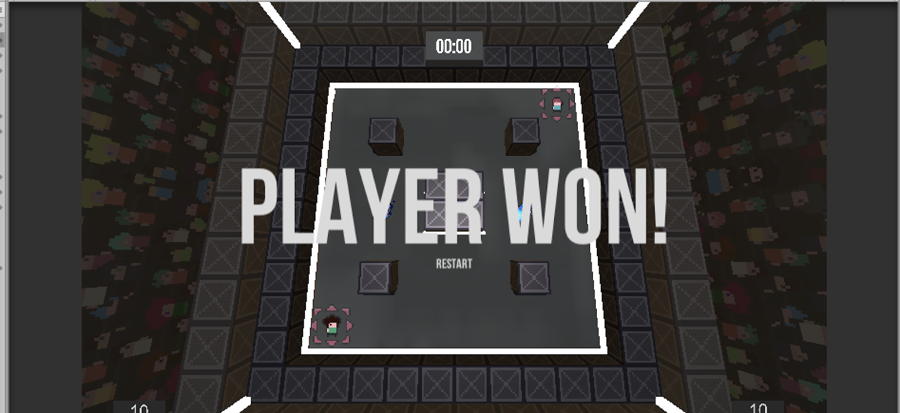
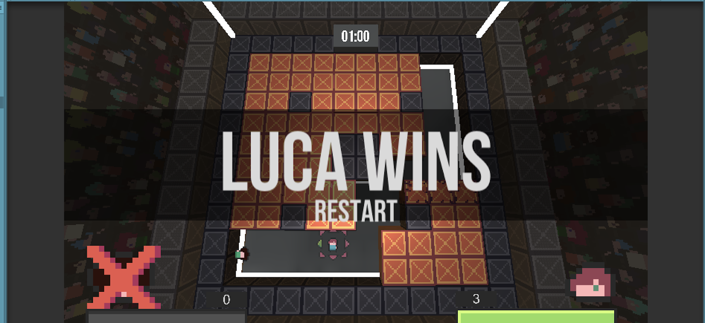
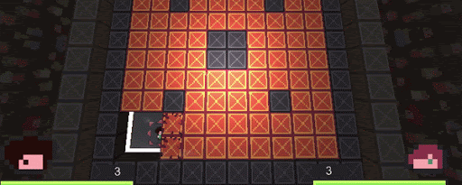
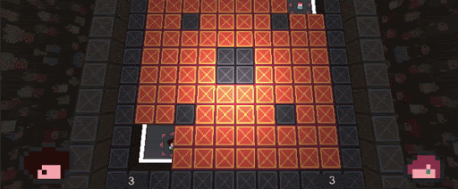

# Playtesting Auswertung

1. [Testbedingungen](##Testbedingungen)
2. [Ergebnisse](##Ergebnisse)
3. [Verbesserungen](##Verbesserungen)

## Testbedingungen

**Spieldauer:**  
5 - 10 Minuten  

**Testpersonen:**  
insgesamt 4 Testpersonen, zwei videospielerfahrene und zwei weniger spielerfahrene Tester*innen  

**Durchführung der Tests:**  
insgesamt wurden 3 Tests durchgeführt. In einem Test spielten die zwei videospielerfahrenen Testpersonen gegeneinander, in den zwei weiteren Tests spielte jeweils eine Tetsperson gegen einen Testleiter (in diesem Fall fand außer durchs Spielen selbst keinerlei Einflussnahme der Testleiter auf die Testperson statt).  

**Fragen nach dem Test:**  
1.: Was fällt dir als Erstes zum Spiel ein?  
2.: Was hat dir gut gefallen?  
3.: Hast du Verbesserungsvorschläge?

## Ergebnisse

### Antworten auf die Fragen:

**1.: Was fällt dir als Erstes zum Spiel ein?**
* "es macht Spaß!"
* "Nochmal! Wie kann ich nochmal spielen?"
* "ich habe Lust, weiter zu spielen, um besser zu werden..."

**2.: Was hat dir gut gefallen?**
* "Die Musik und die Sounds! Sie 'pushen' und steigern die Spannung im Spiel!"
* "Die Größe des Spielfeldes ist gut gewählt. Dass der Gegner sich schnell zu mir Durchboxen kann, erhöht das Tempo des Spiels!"

**3.: Hast du Verbesserungsvorschläge?**  
* "Es wäre gut, wenn man die Blöcke etwas schneller kaputt machen könnte."
* "Etwas mehr Bomben wären besser. Die sind zu schnell leer. Heißt das Spiel nicht power*Bomb*? Man sollte am Anfang mehr Bomben haben oder, wenn man keine mehr hat, nach einiger Zeit eine geschenkt bekommen."
* "Ich würde gerne besser sehen, wie viele Bomben ich noch habe und welche Power-Ups ich gesammelt habe."
* "Das Bombenwerfen fühlt sich blöd an. Man sollte die Bombe legen können."
* "Der Bombenregen am Ende könnte später kommen."

## Verbesserungen

### bereits erfolgte Verbesserungen

* Der Restart-Button wurde vergrößert  

  

* Der Schaden des Spielers an den Blöcken wurde erhöht  

* Die Zeit bis zum Ende der Runde / Sudden-Death wurde von 90 auf 180 Sekunden erhöht

### Verbesserungen, die durch das Playtesting zur Diskussion stehen, aber noch nicht umgesetzt sind

* mehr Bomben: Die Spieler erhalten entweder zu Spielbeginn mehr Munition (zur Zeit initial nur 3 Bomben), oder sie bekommen auch durch Bomben-Power-Ups zusätlich Bomben, oder nach einiger Zeit "for free", wenn sie keine mehr haben.

* Bombenlegen soll möglich sein. Entweder als separate Aktion oder dadurch, dass die Wurfweite durch die Länge des Tastendrucks geregelt wird (kurzes antippen = Legen)

### Ausblick und geplante Verbesserungen im Bezug auf "Kernfeature"

Im Hinblick auf unser Ziel, ein schnelles, kuzweiliges Spiel mit Duellcharakter ([siehe Game Proposal](./01_game_proposal.md)) zu erschaffen, scheinen wir auf einem guten Weg zu sein. Die Spieler stehen beim Spielen unter Spannung und haben nach einer Runde Lust, noch weiter zu spielen!  
Was wir noch erreichen müssen, ist, dass die Bomben und damit auch die Power-ups eine größere Rolle spielen. Hierauf wird in der letzten Phase der Entwicklung unser Fokus liegen. Eventuell wird dies schon lediglich durch das Erhöhen der Munitionsmenge und die Verbesserung des Werfens oder das Ermöglichen des Legens der Bomben erreicht.