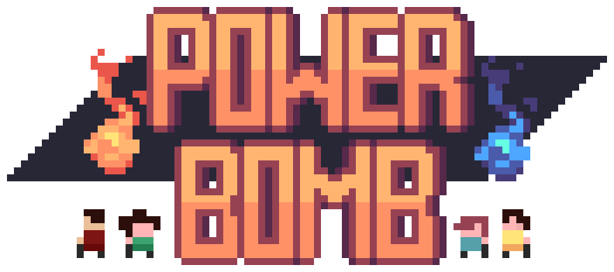
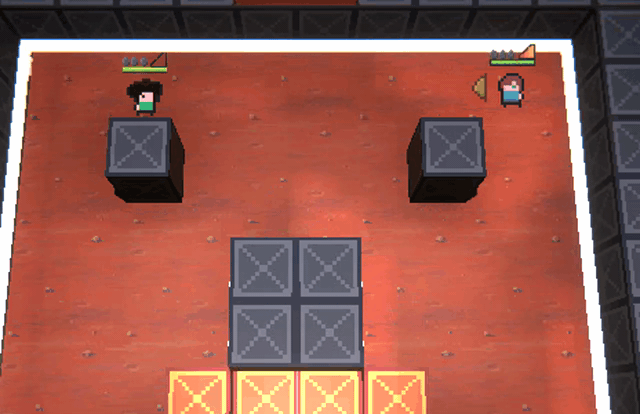
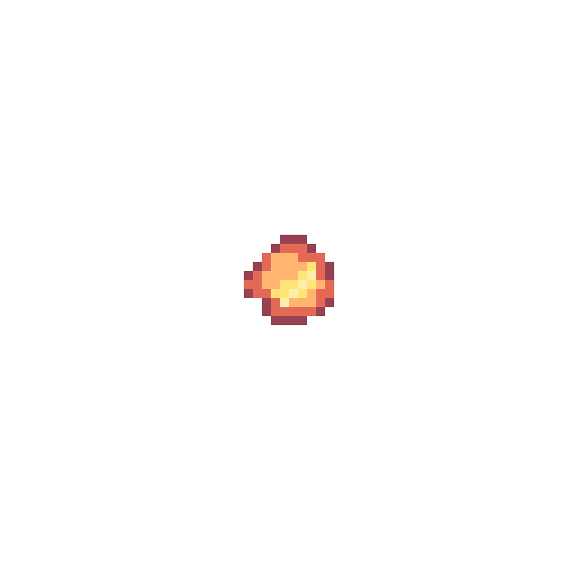
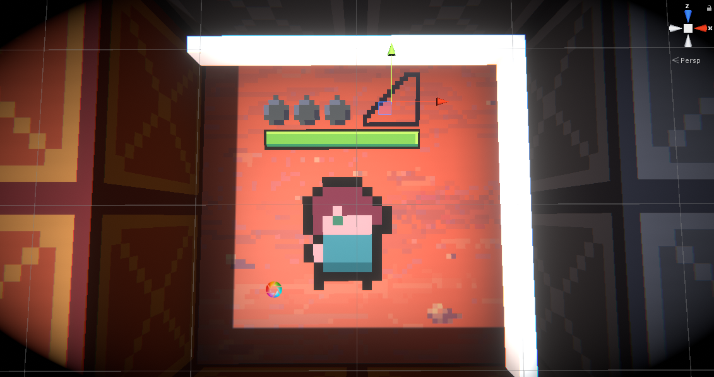
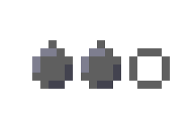
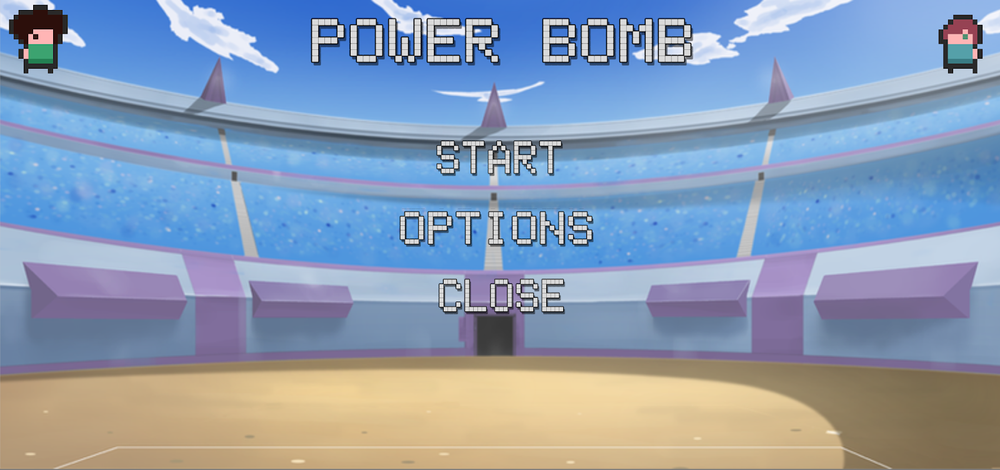
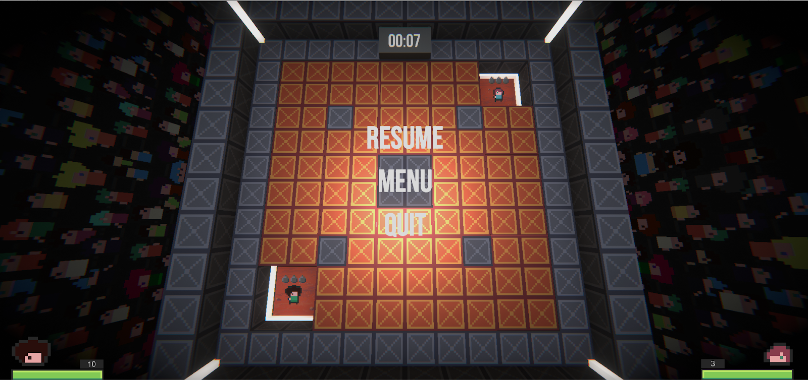
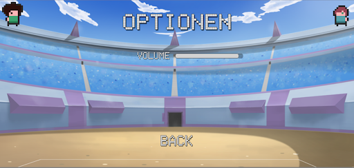
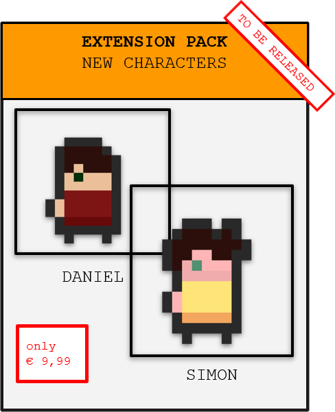

1. [Finale Erbenisse und Änderungen](#Finale-Ergebnisse-und-Änderungen)    
    a. [Bomben](#Bomben)  
    b. [Player](#Player)  
    c. [Power-ups](#Power-ups)  
    d. [Menü](#Menü)   
    e. [Tastenbelegung](#Tastenbelegung)  
2. [Kommentare und Beantwortung der Fragen](#Kommentare-und-Beantwortung-der-Fragen)

# Finale Ergebnisse und Änderungen

(Auszug Kapitel 01, verändert)

Das Spiel "Power Bomb" ist ein Spiel des Genres "Battle Royale" mit dem Klassiker "Bomber-Man" als Vorlage, aber es ist verrückter und lebendiger als sein Vorbild. Die 2D-Charaktere und Umgebungselemente als Pixel-Art im 3D-Raum lassen das alte "Retrogefühl" mit einem neuen, modernen Look verschmelzen.  
Das Spiel ist für all Diejenigen, die diesen Klassiker lieben und ihn mit einem frischen Wind ins 21. Jahrhundert transferiert sehen wollen. Außerdem aber auch für alle, die das Spiel nicht kennen und das Gefühl vom schnellen, kurzweiligen Spiel mit Freunden neu erleben wollen.  
Freunde oder Kontrahenten können sich spontan ein spannendes, ergebnisoffenes Duell liefern, dessen Ausgang sowohl durch das Können als auch durch das Glück der Spieler entschieden wird.  
Ziel des Spiels ist es, der letzte Überlebende zu sein. 

## Bomben

Um dieses Ziel zu erreichen, werfen die Spieler Bomben, die, gut platziert, die Gegner ins Jenseits befördern oder aber, ungeschickt geworfen, auch der eigene Untergang sein können – nicht nur, da sie auch dem Werfenden Schaden zufügen können, sondern auch, weil man nicht zu verschwenderisch mit den Bomben umgehen sollte: man startet mit 3 Bomben und alle 10 Sekunden bekommt man eine neue - ist keine Munition mehr übrig, kann man sich nur noch im Nahkampf wehren - Reagiert man schnell genug, kann man jedoch auch die Bomben der Gegner aufheben und zurückwerfen!

Den Bomben wurde nach dem Alpha-Release ein neues Asset verpasst und eine neue Visualisierung des Explosionsradius sowie der verbleibenden Zeit bis zur Explosion. Außerdem gibt es einen neuen Explosionseffekt.

## Player  

Der Spieler schlüpft in die Rolle eines Mitgliedes des BombSquads (Luca oder Edi). 

Seit dem Alpha-Release wurden dem Spieler 2 GUI-Elemente hinzugefügt, die den momentanen Munitionsstand und die Wurfstärke visualisieren. Der Lebensbalken in der Bildschirmecke wurde entfernt und ein neuer direkt beim Spieler hinzugefügt.

## Power-ups

Im harten Kampf ums Überleben ist jeder Vorteil Gold wert. Die Spieler können, um Vorteile zu erringen, sich selbst oder ihre Bomben mit Power-ups verstärken. Also gilt es, schneller als die Gegner die besten Power-ups zu sammeln und sie nicht zuletzt auch bedacht und effektiv einzusetzen!  
Die begehrten Power-ups sind in zerstörbaren Blöcken versteckt, die sich im Umfeld der Spieler befinden. Sie können durch Bomben oder mit den bloßen Händen zerstört werden. 
Des Weiteren gibt es unzerstörbare Blöcke, die für Spieler und Bomben Hindernisse darstellen.

**Die Power-ups repräsentieren jeweils ein Element oder eine Jahreszeit**, welches das Thema für das Modul ist: Die erfrischende, wohltuende Lebensblume repräsentiert den Frühling, die glühend heiße Feuerbombe den Sommer, der Speed-Blitz steht für ein Herbstgewitter und die klirrend kalte Eisbombe für den Winter. Die Effekte aufgesammelter Power-ups für Bomben addieren sich, sodass eine Bombe gleichzeitig die Feuer- und Eiseffekte haben kann und mit jedem eingesammelten Power-up wird der Explosionsradius größer!

Seit dem Alpha-Release haben alle Power-ups eine neue, besser sichtbare Animation beim Einsammeln bekommen und die Bomben-Power-ups ein neues, selbstgemachtes Partikel-System für ihren Effektbereich bekommen.

Die Spieler werden von einem Timer begleitet. Wenn er abläuft, kommt es zum Sudden-Death: Ein tödlicher Bombenregen bricht über die Spieler herein!  
Die Storyline von "Power Bomb" ist nicht konkreter als das Szenario, in dem es gespielt werden soll: Zwei bis vier Charaktere sind gemeinsam in einem Duell gefangen und am Ende steht ein Sieger fest! Warum haben sie Bomben? Wieso sollen sie sich gegenseitig in die Luft jagen? Warum kann es gleichzeitig Frost und Feuer geben? Unwichtig, der Spielspaß kommt durch die Spontanität der Zusammenkunft, das gemeinsame Spielerlebnis und den Duellcharakter zustande!

## Menü

Mit dem Menü wird die Möglichkeit gegeben, das Spiel zu starten und zu beenden, mit dem Aufrufen des Pausenmenüs kann das Spiel pausiert werden. Ohne die Menüs würde sich das Spiel nicht wie ein vollständiges Produkt anfühlen.

Seit dem Alpha-Release wurde das Pausenmenü hinzugefügt und in den Optionen die Einstellungsmöglichkeit zur Helligkeit entfernt.

## Tastenbelegung

### Edi
* Bewegen: W, A, S, D
* Bombe werfen: Leertaste (gedrückt halten: weiter werfen)
* Bombe aufheben: E
* Nahkampf: Q

### Luca
* Bewegen: Pfeiltasten
* Bombe werfen: Eingabe (gedrückt halten: weiter werfen)
* Bombe aufheben: Umaschalt rechts
* Nahkampf: Backspace

# Kommentare und Beantwortung der Fragen

## a) Wie gut ließen sich ihre anfänglichen Ideen in das finale Spiel umsetzen? Konnten Sie ihren Zeitplan einhalten? b) Wo sind sie stark davon abgewichen? 

Viele der anfänglichen Ideen konnten wir in den ersten Wochen der Entwicklung relativ schnell implementieren. Einige Ideen brauchten etwas Zeit und Pflege während und andere Ideen konnten wir aus verschiedenen Gründen nicht implementieren. Die Grafiken für die Spieler wurden schon recht am Anfang erstellt und auch die Kommunikation und Einigkeit unter der Gruppe führte dazu das wir auch schnell den Local-Multiplayer implementiert hatten.  
Das Konzept der Power-ups in Kombination mit dem Bomben-Manager haben wir im Team auch mit Erfolg meistern können. Zwei Aspekte konnten wir doch leider nicht bis zum Ende implementieren. Zum Einen das Networking - Die Implementation des Networkings hätte viel Arbeit gekostet ohne Gewissheit, dass diese am Ende auch zufriedenstellend funktionieren würde. So haben wir uns für Local Multiplayer entschieden, um mehr Zeit für das eigentliche Spiel zu haben.  
Zum Anderen fehlt die geplante Möglichkeit der Auswahl mehrerer Charaktere - gegen Ende waren die Kapazitäten unseres Graphics-Künstlers mit dem Erstellen neuer Assets und dem Produzieren des Videos erschöpft, sodass keine Zeit blieb, die notwendigen zusätzlichen Sprites und Animationen zu erstellen.  

 Die Entwicklung der Bomben hat mehr Aufmerksamkeit bekommen, als geplant. Wir hatten erwartet, die Bomben direkt zu Anfang zu implementieren, um uns dann auf andere Dinge zu konzentrieren, beispielsweise Networking. Allerdings waren wir bis zum Schluss waren wir mit Balancing, Fine-Tuning, Debugging und dem Implementieren zusätzlicher Features (Zurückwerfen) beschäftigt.  
 Diese vom Plan abweichend große Zeitinvestition in die Entwicklung der Bomben ist nach unserer Ansicht jedoch eine gute Entscheidung gewesen. Schließlich war das Ziel des Moduls, eine Sache besonders gut zu machen - so können wir jetzt mit den Bomben zufrieden sein.  

 Außerdem haben wir, wie sich schon im Playtesting, aber auch später beim Spielen des fertigen Spiels gezeigt hat, unser Ziel erreicht, die "Big Idea", ein schnelles, kurzweiliges Spiel zu erschaffen, das zum wiedeholten Spielen und zum Auffordern zu Duellen einlädt.

## c) Wie haben die Elemente des Kurses (Entwicklungsplan, Prototyp, Playtesting etc.) das Fortkommen im Kurs begünstigt oder behindert? 

Die vorgegebenen Meilensteine und das Einteilen in Entwicklungslayers haben unsere Entwicklung gut strukturiert und unsere Arbeit effizienter gemacht. Während uns der physische Prototyp wenig nützliche Informationen gab, gab uns das Playtesting wertvolle Anregungen, die wir so nicht bekommen hätten. Das Playtesting hatte uns auf einige Usability-Probleme aufmerksam gemacht, welche wir in späteren Version versucht haben, zu beheben: beispielsweise das Verschieben der Spielerinformationen von der Bildschirmecke direkt zum Spieler sowie die Vergrößerung des Restart-Buttons. Daneben hat uns das Feedback und die Diskussion im Kurs neue Ideen gegeben, wie wir unser Spiel noch verändern können: das Zurückwerfen der Bombe sowie das Erneuern der Bomben-Assets (Explosions-Countdown, Explosionsradius, hellere Bombe).

## d) Konnten Sie ihre Erwartungen umsetzen? Sind Sie stolz auf das Spiel? 

Unsere Vision des Spiels und damit unsere Erwartungen konnten wir verwirklichen und sind stolz darauf.
Natürlich finden wir noch viele weitere Elemente (s.o.), die wir noch implementieren können. Doch die jetzige Version des Spiels erfüllt all unsere Kriterien, welche wir am Anfang für unser Spiel mit der "Big idea" und in der Spielbeschreibung gesetzt haben. Das Gameplay fühlt sich gut an, Spaß und Adrenalin im Kampf gegen den Gegner sind garantiert und durch Sounds und Musik wird eine Atmospähre geschaffen, welche diese Aspekte verstärkt und so das Spiel gut abrundet.

## e) Hatten Sie genug Zeit? 

Für die wichtigsten Funktionen und Features hatten wir genug Zeit, da wir Anfangs schon viel schaffen konnten; wir hatten genug Zeit, um ein Ergebnis zu erreichen, mit dem wir zufrieden sind - sicherlich hätten wir gerne noch die fehlenden geplanten Elemente eingebaut oder weitere Ideen verwirklicht.  
Doch durch die limitierte Zeit haben wir gelernt, damit umzugehen, dass man nie alles schaffen kann und priorisieren muss. Das war eine wichtige Lektion.  

## f) Was war die größte technische Schwierigkeit? 

Die größte technische Schwierigkeit war die Implementierung der Bomben und das Verbinden mit den Power-ups. 

## g) Sind sie mit dem Thema des Kurses klar gekommen? 

Da wir die Freiheit hatten, das Thema des Wetter stark zu abstrahieren, fiel uns das Einbinden des Themas recht leicht, ohne dass es in unserem Spiel "aufgesetzt", sondern eingebettet wirkt, da die Wetter-Power-Ups ein elementarer Bestandteil des Spiels sind. 

## h) Hat Ihnen die Arbeit mit dem Thema Spaß gemacht, oder hätten Sie lieber mehr Freiheit gehabt? 

Die Vorgabe eines Themas und das Arbeiten damit hat Spaß gemacht und war zu Beginn ein willkommener Anstoß des kreativen Denkens. Durch die lockere Auslegung fühlten wir uns in unserer Freiheit nicht eingeschränkt.

## i) Was würden Sie bei ihrem nächsten Spiel anders machen? 

Wir würden versuchen, eine klare Code-Struktur aufzubauen, eventuell auch Skizzen mit Beziehungen und Beschriftengen der Skripte. Eigene Guidelines, wie was auszusehen hat, hätten auch hilfreich sein können. Da wir alle programmiert haben, mussten wir uns oft durch anderen Code durchlesen und die Funktionsweise erfragen. 

## j) Was war der größte Erfolg während des Projekts? War das Projekt ein Erfolg? 

Der größte Erfolgsmoment war es, die erste Bombe zu werfen und von ihr zu sterben (R. I. P. Edi). Das Projekt war ein Erfolg, da wir mit dem Ergebnis zufrieden sind und auf dem Weg dorthin viel gelernt haben - nicht nur, mit Unity umzugehen, sondern auch, besser im Team zu arbeiten und die Zeit und Arbeit aufzuteilen.

## k) Haben Sie Vorschläge zur Verbesserung des Kurses?

Eventuell hätte es geholfen, noch mehr zu lernen, wie man Code bzw. die Skripte in Unity gut strukturiert. Manchmal war es schwierig, den Überblick zu behalten. Vielleicht ein Treffen, in dem wir unseren Code und unsere Skripte zeigen und Feedback kriegen: Was könnte / sollte man anders machen? Was ist gut gelungen?

## l) Mochten Sie Unity?

Die Arbeit mit Unity hat uns sehr viel Spaß gemacht. Nicht nur, weil uns viel Arbeit abgenommen wird, sondern vor Allem wegen der Community. Zu jeder Frage, die man sich stellt, findet man meist eine gute Antwort oder sogar ein Video-Tutorial!
